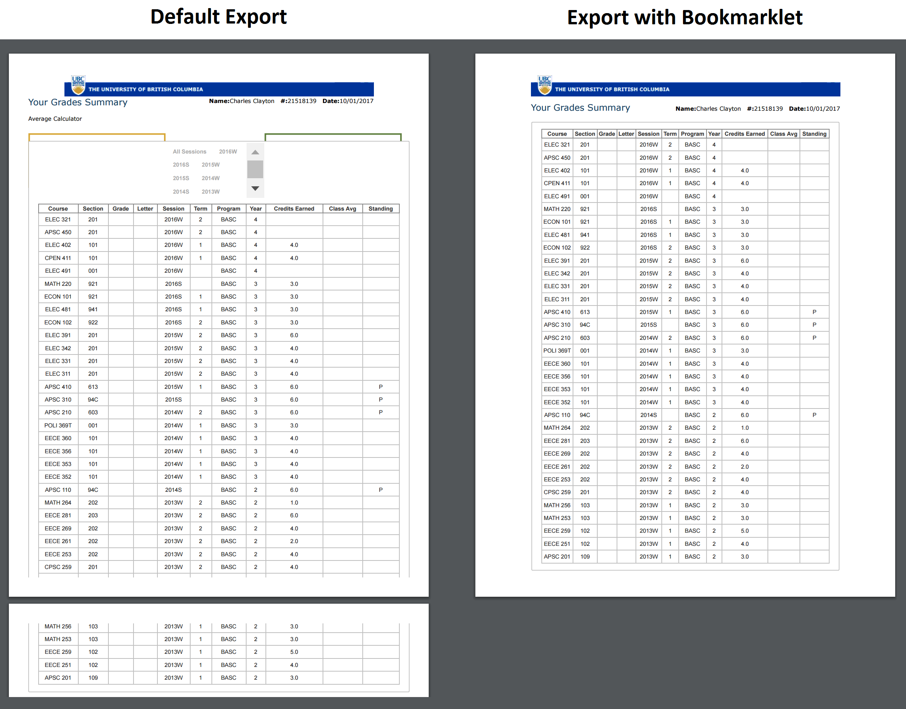

# UBC Unofficial Transcript Exporter

By default, the unofficial transcript you can download from the UBC student service center is quite ugly. It has some unattractive clutter at the top that forces it to spill over into the next page. It may be trivial, but when applying for jobs or graduate school, you probably want a cleaner and more professional looking transcript.

## Instructions

To export your unofficial transcript, go to your Grades Summary page here: https://ssc.adm.ubc.ca/sscportal/servlets/SRVSSCFramework?function=SessGradeRpt

Then [Drag this link to your bookmarks bar][1]

[Hello World!][1]

## Output

The code gets rid of the extra tabs/average calculator app, spaces things out a little better, and aligns the table to the header. 

[1]:javascript:alert('Hello World')
